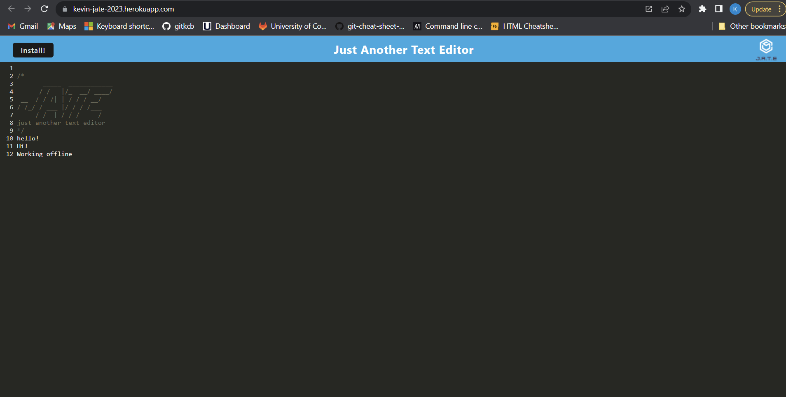
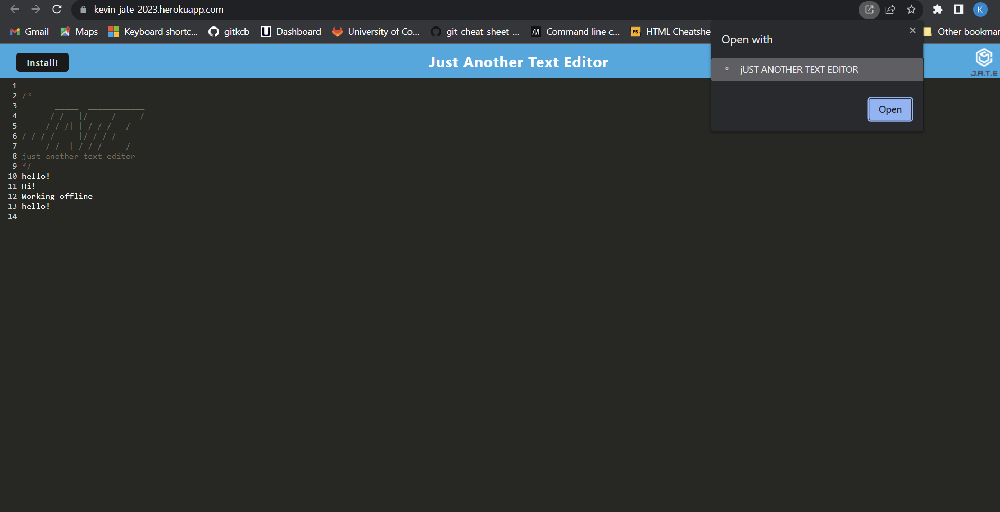
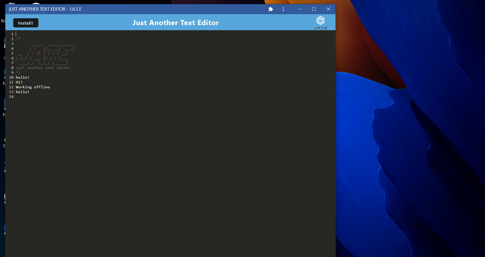

# Text_Editor
Deployed Heroku App:  
https://kevin-jate-2023.herokuapp.com/

Github Repository:  
https://github.com/gitkcb/text_editor
## Description
This application was created to have a user write down their notes throughout the day. The user can also install the app to their desktop to write notes more conveniently. This gives the user a paper free way to keep track of their ideas. I learned how to incorporate service workers, manifest.json, and caching to indexedDB.  

## Installation

run command `npm run start` on root level of application. 

## Usage

## Credits

Original code from:  
https://github.com/coding-boot-camp/cautious-meme
